<h1 align="center">
  <a href="#">
    
  </a>
  <br>
  <p>RajeSync – Appointment Scheduling System.</p>
</h1>

<p align="center">
<a href="#"></a>
<a href="#"></a>
<a href="#"></a>
<a href="#"></a>
<a href="#"></a>
<a href="#"></a>
<a href="#"></a>
<a href="#"></a>
<a href="#"></a>
</p>

<p align="center">
  <a href="#overview">Overview</a> •
  <a href="#features">Features</a> •
  <a href="#technologies-used">Technologies Used</a> •
  <a href="#download-apk">Download APK</a> •
  <a href="#installation">Installation</a> •
  <a href="#usage">Usage</a> •
  <a href="#screenshots">Screenshots</a> •
  <a href="#contributing">Contributing</a> •
  <a href="#license">License</a> •
  <a href="#contact">Contact</a>
</p>

---

## Overview

This Appointment Scheduling App is a React Native mobile application designed to simplify booking appointments with service providers. Users can register, browse providers, select available time slots, and manage their appointments in a single, smooth mobile interface.

The app integrates with a Node.js backend running on Bun, supporting JWT authentication with Redis blacklist management and MongoDB for data storage.

---

## Features

### Core System Features
- User registration, login, and logout with token-based authentication.
- View list of service providers including name, category, and profile image.
- Select providers and available time slots to book appointments.
- View upcoming appointments and cancel bookings if needed.
- Offline support with mock data for testing.

### User Features
- Manage profile details.
- Browse provider details and schedule appointments.
- Track and cancel booked appointments.
- Secure authentication and token management with Redis.

### Backend Features
- JWT authentication and Redis-based token blacklist.
- CRUD for providers and appointments.
- Secure REST API endpoints for mobile app consumption.
- Rate-limiting and middleware security features.

---

## Technologies Used

### Frontend
- React Native (Expo)
- TypeScript
- NativeWind (TailwindCSS for React Native)
- React Query (TanStack Query)
- Axios for API communication

### Backend
- Node.js + Express
- Bun runtime
- MongoDB (Mongoose)
- JWT for authentication
- Redis for blacklisted tokens

### Additional Tools
- SecureStore for local storage
- Expo vector icons and DateTime picker
- React Navigation (Bottom Tabs)
- Toast messages and custom UI components

---


## Download APK

### Backend Deployment

* The backend has been deployed on Render and is accessible publicly.
* API URL: `https://rajesync.onrender.com`
  (update `axiosInstance.ts` in mobile if needed)

### Mobile App APK

* The Android APK has already been built and included in the repository at:

  `/resource/app.apk`

* Alternatively, the APK is available via the public Expo download link:

  [Download APK](https://expo.dev/artifacts/eas/sM3TvJUn8gwraF1qvTfjxT.apk)

---

### APK Installation Instructions

#### Option 1: Install from GitHub Repository

1. Open this link on your Android device to download the APK:

```
https://github.com/rajendrapancholi/rajesync/blob/main/resource/app.apk?raw=true
```

2. Once downloaded, open your device **File Manager** and navigate to the downloaded file.
3. Tap on `app.apk` to begin installation.
4. If prompted, allow installation from **unknown sources** in your device settings.
5. Wait for the installation to complete, then open the app.

#### Option 2: Install from Expo Public Link

1. Open the APK download link in your mobile browser.
2. The APK will download automatically.
3. Once downloaded, tap the notification or open it from the **Downloads** folder.
4. Allow installation from **unknown sources** if prompted.
5. Launch the app once installation finishes.

---

## Installation

### 1. Clone the Repository

```bash
git clone https://github.com/rajendrapancholi/rajesync.git
cd rajesync
```

###  2. Backend Setup
```bash
cd backend
bun install
bun run dev
Backend API runs on http://0.0.0.0:5000 (adjust in axiosInstance.ts if needed).
```

### 3. Mobile App Setup
```bash
cd mobile
npm install
npx expo start -c
Make sure the backend server is running before starting the mobile app.
```

### 3. Configure Environment Variables

#### mobile
Create a `.env` file:

```env
EXPO_PUBLIC_BASE_API=https://rajesync.onrender.com/api
EXPO_PUBLIC_TOKEN_KEY=token
```

#### backend
```env
PORT=
HOST=
CLIENT_ORIGIN=
REDIS_URL=
MONGODB_URI=
JWT_SECRET=
```

---

## Usage

### For Users
- Register or log in to the app.
- Browse the list of service providers.
- Select a provider and an available time slot to book an appointment.
- View upcoming appointments in your dashboard.
- Cancel any booking if needed.

### For Backend Admin
- Manage service providers and appointments through API.
- Validate JWT tokens and manage Redis blacklist.
- Monitor database collections for appointments and users.

---

## Screenshots

Add your real screenshots later. Placeholder examples:

### Home (wihout credentials)
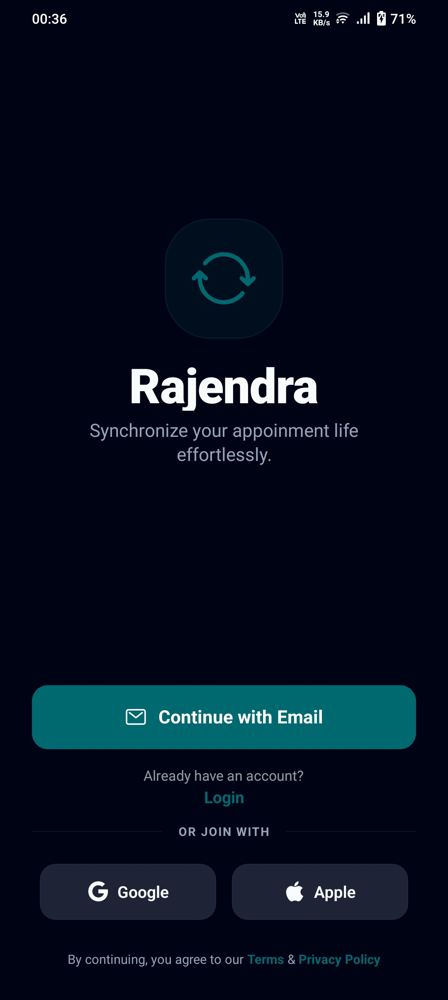

---


### Register
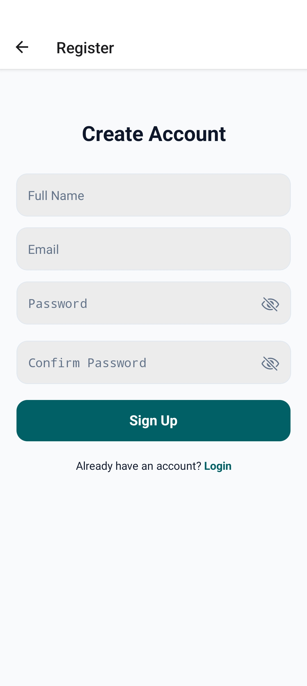

---

### Login
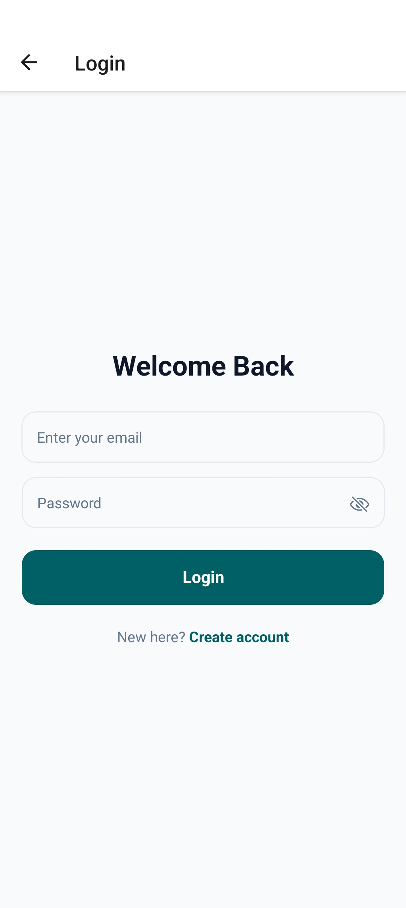

---

### User Dashboard
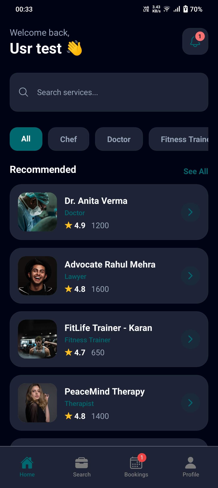

---
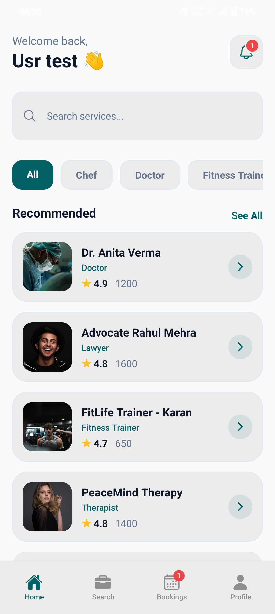

---

### Service provider List
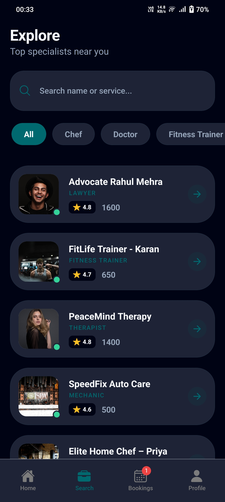

---

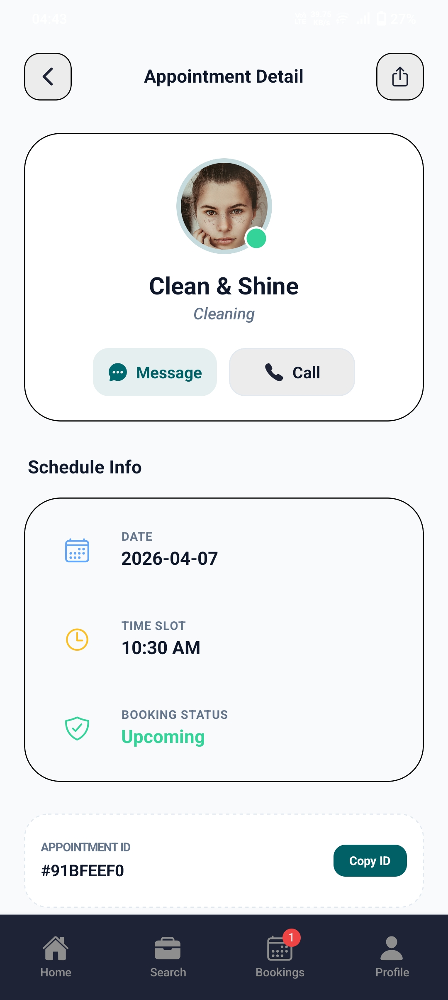

---

### Provider Details
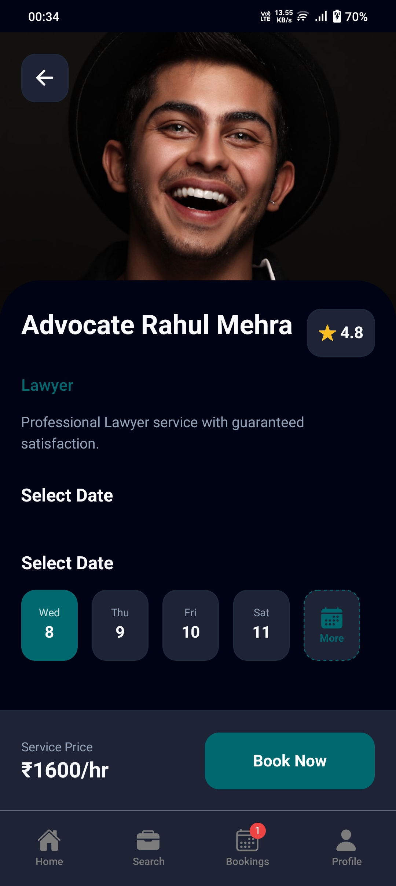

---

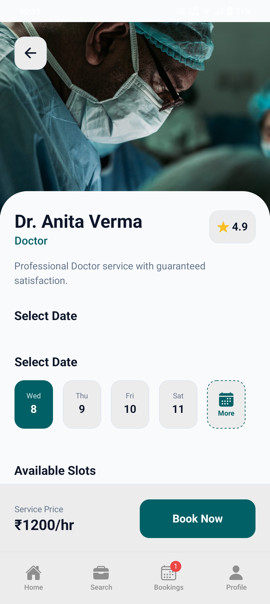

---


---


### Appointment Booking
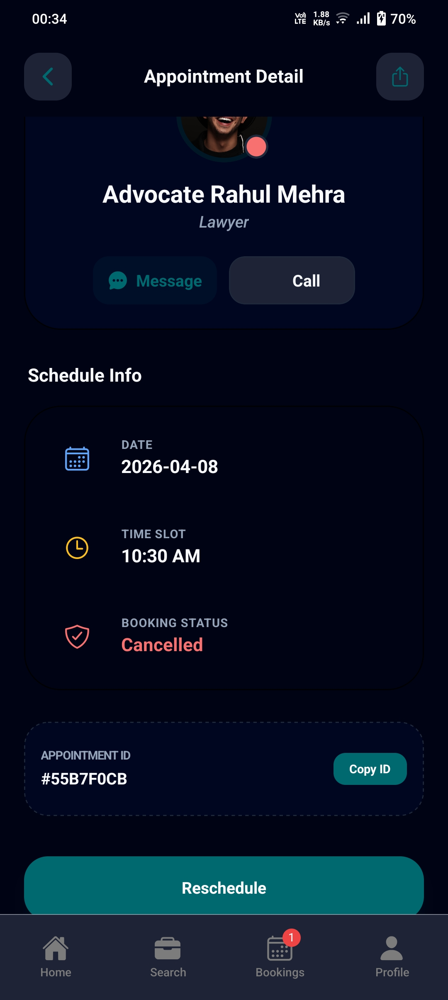

---

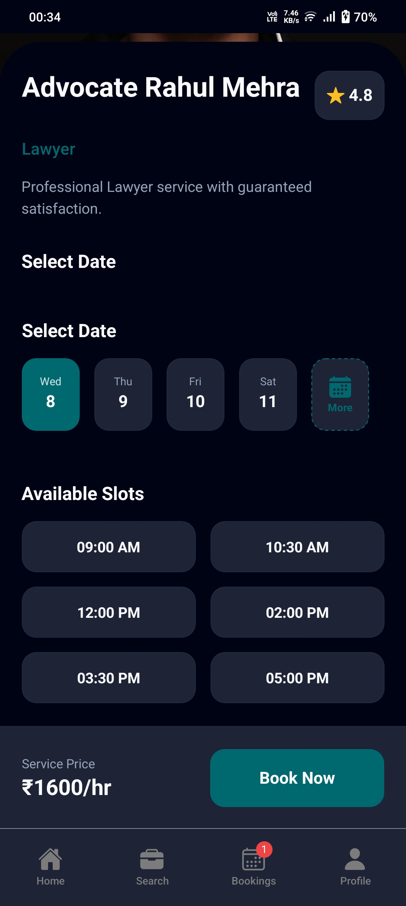

---


### Appointments List


---

### My Booking or appointment
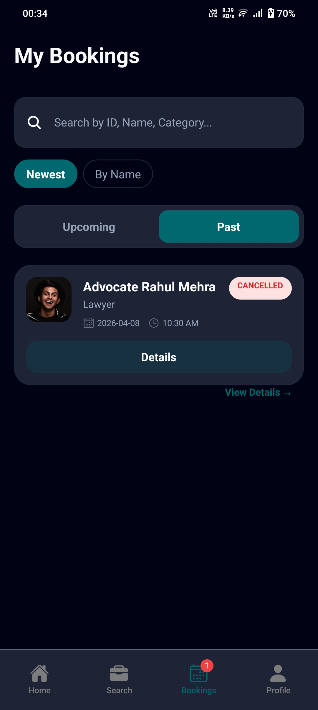

---

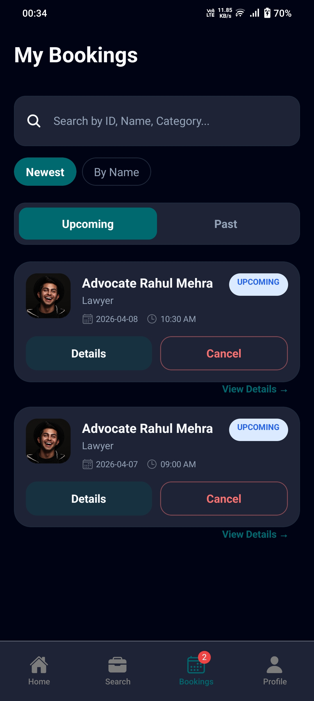

---

### Reschedule appointment
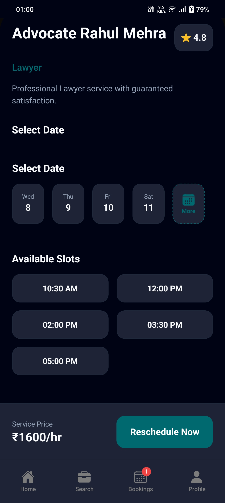

---

### Profile / Settings
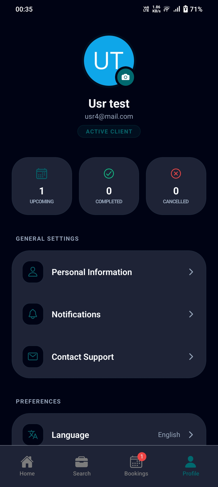

---

---

## Contributing

We welcome contributions.

1. Fork the repository.
2. Create a new branch:

```bash
git checkout -b feature-name
```

3. Commit your updates:

```bash
git commit -m "Add feature-name"
```

4. Push the branch:

```bash
git push origin feature-name
```

5. Open a Pull Request.

---

## License

This project is under the MIT License.
See the [LICENSE](LICENSE) file for details.

---

## Contact

* **Project Owner:** Rajendra Pancholi
* **Email:** [rpancholi522@gmail.com](mailto:rpancholi522@gmail.com)
* **GitHub:** [https://github.com/rajendrapancholi](https://github.com/rajendrapancholi)
* **LinkedIn:** [https://www.linkedin.com/in/rajendra-pancholi](https://www.linkedin.com/in/rajendra-pancholi-11a3a5286)

---

